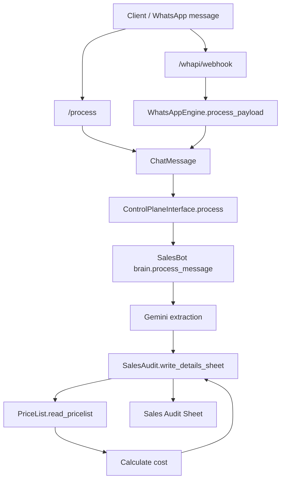
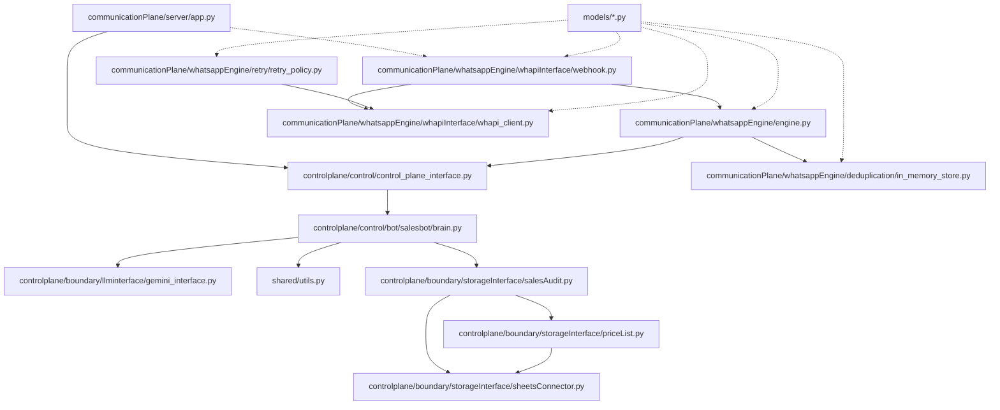

## hotelStaffManager

## Overview
This service ingests WhatsApp sales messages, extracts structured fields using Gemini, and logs the results into Google Sheets. Pricing is calculated from a separate pricelist sheet.

Why the tunnel and domain matter:
WHAPI sends webhooks from the internet to your server. A laptop on a home network does not have a stable public IP, so Cloudflare Tunnel provides a stable public URL without exposing your machine directly.

## Prerequisites
- Python 3.11+
- A Google Cloud service account JSON with Sheets access
- A WHAPI account + token
- Cloudflare account with a domain (for public webhook)
- `cloudflared` installed on the machine that runs the server

## Quickstart (Local + Public Webhook)
1) Install dependencies:
```bash
cd <PROJECT_ROOT>
python -m pip install -r requirements.txt -r requirements-dev.txt
```

2) Create `env` at project root (example):
```
GEMINI_API_KEY=...
GOOGLE_SHEETS_KEY=envConfig/sales/salesAccount.json
SALES_AUDIT_SHEET_ID=...
SALES_PRICELIST_SHEET_ID=...

WHAPI_TOKEN=...
WHAPI_BASE_URL=https://gate.whapi.cloud
WHAPI_TOKEN_IN_QUERY=0
WHAPI_TIMEOUT=20

TUNNEL_TOKEN=...
SERVER_HOST=127.0.0.1
SERVER_PORT=5050
```

3) Start the stack:
macOS/Linux:
```bash
<PROJECT_ROOT>/communicationPlane/publicTrafficHandler/start_whatsapp_stack.sh
```

Windows (PowerShell):
```powershell
<PROJECT_ROOT>\\communicationPlane\\publicTrafficHandler\\start_whatsapp_stack.ps1
```

4) Test locally:
```bash
curl -X POST http://127.0.0.1:5050/process \
  -H "Content-Type: application/json" \
  -d '{"message":"Service: 2 Hammame\nDate: 04/03/2026\nGuest:2px\nTime:6:00pm\nRoom:The Sahara Room\nArjun Rampal"}'
```

5) Test public webhook (after tunnel + DNS are set):
```bash
curl -X POST https://kodesia.tech/whapi/webhook \
  -H "Content-Type: application/json" \
  -d '{}'
```

## Local Setup (Details)
### Environment notes
- `GOOGLE_SHEETS_KEY` can be relative and resolves against the project root.
- Share both sheets with the Google service account email in the service-account JSON.
- `SERVER_PORT` defaults to `5050` because macOS AirPlay often occupies `5000`.

### Required env variables
```
GEMINI_API_KEY
GOOGLE_SHEETS_KEY
SALES_AUDIT_SHEET_ID
SALES_PRICELIST_SHEET_ID
WHAPI_TOKEN
TUNNEL_TOKEN
SERVER_HOST
SERVER_PORT
```

### Health endpoint
The server exposes:
```
GET /health -> {"status":"ok"}
```

## Operations
### Daemonize the tunnel (optional)
To keep the tunnel running in the background without blocking a terminal:
```bash
<PROJECT_ROOT>/communicationPlane/publicTrafficHandler/tunnel_daemon.sh start
```

Stop it later:
```bash
<PROJECT_ROOT>/communicationPlane/publicTrafficHandler/tunnel_daemon.sh stop
```

Windows (PowerShell):
```powershell
<PROJECT_ROOT>\\communicationPlane\\publicTrafficHandler\\tunnel_daemon.ps1 start
<PROJECT_ROOT>\\communicationPlane\\publicTrafficHandler\\tunnel_daemon.ps1 stop
```

Note: `start_whatsapp_stack.sh` will detect the running tunnel and skip starting a second one.

### Production notes
- For production, run the Flask app with a WSGI server (e.g., `gunicorn`) via `SERVER_CMD`.

## Domain, Routes, DNS, and Tunneling
### Why you need a tunnel
WHAPI must POST to a public URL. Laptops typically sit behind NAT with no fixed public IP. A Cloudflare Tunnel creates a secure outbound connection from your laptop to Cloudflare so that `https://kodesia.tech` can reach your local server.

### How the routing works
- You configure a Cloudflare Tunnel (named `hotelstaffmanager.prod`).
- You attach a Public Hostname for your domain (for example `kodesia.tech`).
- The Public Hostname routes to your local service, for example `http://localhost:5050`.
- WHAPI posts to `https://kodesia.tech/whapi/webhook` (or `/whapi/webhook/messages`).

### DNS record requirement
Your domain must resolve to Cloudflare and be proxied. Cloudflare automatically creates a CNAME record pointing at `<TUNNEL_ID>.cfargotunnel.com` when you add the Public Hostname in Zero Trust.

### Cloudflare setup (UI)
1) Zero Trust → Tunnels → Create tunnel.
2) Public Hostnames → Add.
3) Hostname: `kodesia.tech` (or your domain).
4) Service: `http://localhost:5050`.
5) Save and run the tunnel using the token.

### WHAPI webhook setup
1) In WHAPI dashboard, open Webhooks/Notifications.
2) Set Webhook URL to:
```
https://kodesia.tech/whapi/webhook
```
or:
```
https://kodesia.tech/whapi/webhook/messages
```
3) Enable message events.

### Minimal tunnel setup (token-based)
1) Install cloudflared.
2) Add a Public Hostname in Zero Trust that points to `http://localhost:5050`.
3) Start the tunnel:
```bash
cloudflared tunnel run --token "<TUNNEL_TOKEN>"
```

#### Windows cloudflared install
Option 1 (winget):
```powershell
winget install Cloudflare.cloudflared
```

Option 2 (Chocolatey):
```powershell
choco install cloudflared
```

Then verify:
```powershell
cloudflared --version
```

### Webhook endpoint
Your app registers:
```
POST /whapi/webhook
POST /whapi/webhook/messages
```
Use one of the above as the WHAPI webhook URL.

## Local Testing
### Run all checks (recommended)
```bash
<PROJECT_ROOT>/scripts/run_checks.sh
```

Optional flags:
- `SKIP_PIP_AUDIT=1` skips `pip-audit`
- `RUN_INTEGRATION=1` runs integration tests

### Run individual tools
```bash
python -m ruff check .
python -m ruff format --check .
python -m mypy .
python -m bandit -c bandit.yaml -r .
python -m pip_audit -r requirements.txt -r requirements-dev.txt
pytest tests/unit
```

### Integration tests
Integration tests hit real Google Sheets and are opt-in via env:
```bash
HEALTHCHECK_WRITE=1 HEALTHCHECK_TESTPY=1 pytest tests/integration -m integration
```

### WHAPI end-to-end check (manual)
Send a message in the group and confirm the webhook is received by checking server logs.

## Debugging
### Fast checklist
1) Local health:
```bash
curl -i http://127.0.0.1:5050/health
```

2) Local process endpoint:
```bash
curl -i -X POST http://127.0.0.1:5050/process -H "Content-Type: application/json" -d '{"message":"ping"}'
```

3) Public health:
```bash
curl -i https://kodesia.tech/health
```

4) Public webhook:
```bash
curl -i -X POST https://kodesia.tech/whapi/webhook -H "Content-Type: application/json" -d '{}'
```

### Common issues and fixes
Issue: `curl` returns AirTunes or 403 on localhost.
Fix: You are hitting macOS AirPlay on port 5000. Use `SERVER_PORT=5050` and update the Cloudflare service to `http://localhost:5050`.

Issue: WHAPI says 404 for `/whapi/webhook/messages`.
Fix: Ensure your webhook URL is `https://kodesia.tech/whapi/webhook/messages` or use `https://kodesia.tech/whapi/webhook`.

Issue: Public URL returns 404.
Fix: Cloudflare tunnel is pointing to the wrong local port or server is not running.

Issue: Public URL returns 403 with Apple headers.
Fix: Your Cloudflare service still points to `http://localhost:5000` (AirPlay). Update it to `http://localhost:5050`.

Issue: WHAPI end-to-end message not seen.
Fix: Check that the webhook URL is correct (`/whapi/webhook` or `/whapi/webhook/messages`) and that the tunnel is routing to the correct local port.

Issue: `curl` cannot resolve the domain but `dig @1.1.1.1` works.
Fix: Your local DNS cache is stale. Follow the DNS steps below.

### DNS resolution for public tunnel
If `dig` resolves the domain but `curl` cannot, your local resolver is stale.

1. Verify public DNS:
```bash
dig +short kodesia.tech @1.1.1.1
dig +short kodesia.tech @8.8.8.8
```

2. If those return IPs but local `dig` does not, update Mac DNS:
System Settings → Wi‑Fi → Details → DNS → add:
```
1.1.1.1
8.8.8.8
```

3. Flush local caches and restart Wi‑Fi:
```bash
sudo dscacheutil -flushcache
sudo killall -HUP mDNSResponder
```

4. Confirm local DNS and test:
```bash
dig +short kodesia.tech
curl -i https://kodesia.tech/process
```

5. Bypass local DNS temporarily (replace IP with any from `dig`):
```bash
curl -i --resolve kodesia.tech:443:172.67.139.224 https://kodesia.tech/process
```

### Test layout
- `tests/unit/communicationPlane/whatsappEngine/`: WhatsApp engine unit tests (dedup, retry, engine, webhook).
- `tests/unit/controlplane/salesbot/`: SalesBot brain unit tests.
- `tests/unit/controlplane/boundary/`: Boundary unit tests (LLM interface, sheets helpers).
- `tests/unit/shared/`: Shared utility unit tests.
- `tests/integration/test_sheets_connector.py`: Integration tests hitting real Google Sheets.
- `tests/integration/communicationPlane/publicTrafficHandler/`: Integration tests for tunnel/start scripts (stubbed).
- `tests/integration/communicationPlane/whatsappEngine/`: Integration tests for webhook + engine flow (local Flask client).

### How to run specific tests
- WhatsApp engine unit tests:
  - `pytest tests/unit/communicationPlane/whatsappEngine`
- SalesBot unit tests:
  - `pytest tests/unit/controlplane/salesbot`
- Boundary unit tests:
  - `pytest tests/unit/controlplane/boundary`
- Shared unit tests:
  - `pytest tests/unit/shared`
- Integration tests:
  - `pytest tests/integration -m integration`

## CI Jobs
CI runs on pull requests only. Jobs are parallelized for faster feedback.

### `lint`
- Runs `ruff check .`
- Catches syntax errors, unused imports, style issues, and common bug patterns.

### `format`
- Runs `ruff format --check .`
- Ensures consistent formatting without mutating code in CI.

### `typecheck`
- Runs `mypy .`
- Verifies type annotations and catches type mismatches.

### `bandit`
- Runs `bandit -c bandit.yaml -r .`
- Security lint for risky patterns (e.g., shell injection, weak crypto).

### `pip-audit`
- Runs `pip_audit -r requirements.txt -r requirements-dev.txt`
- Checks dependencies for known CVEs.

### `unit-tests`
- Runs `pytest tests/unit`
- Fast tests that don’t hit external services.

### `integration-tests`
- Runs `pytest tests/integration -m integration`
- Hits real Google Sheets.
- Only runs when required secrets are present.

### CI Secrets (repo-level)
Required for integration tests:
- `GOOGLE_SHEETS_JSON`
- `SALES_AUDIT_SHEET_ID`
- `SALES_PRICELIST_SHEET_ID`

Optional:
- `GEMINI_API_KEY`
- `ENABLE_WRITE_TESTS` (set to `1`)
- `ENABLE_TESTPY_INTEGRATION` (set to `1`)

## Code Flow


## Module Guide


- `controlplane/boundary/storageInterface/sheetsConnector.py`
  - Shared connector for Google Sheets, handles auth and worksheet selection.
- `controlplane/boundary/storageInterface/priceList.py`
  - Read/write wrapper around the sales pricelist sheet.
- `controlplane/boundary/storageInterface/salesAudit.py`
  - Read/write wrapper around the sales audit sheet.
  - Calculates cost using the pricelist data.
- `controlplane/control/control_plane_interface.py`
  - Dispatches `ChatMessage` to the right bot (currently SalesBot).
- `controlplane/control/bot/salesbot/brain.py`
  - Message extraction and orchestration logic.
- `controlplane/boundary/llminterface/gemini_interface.py`
  - Gemini client wrapper with fixed model/config.
- `shared/utils.py`
  - Shared helpers (e.g., `safe_json_parse`).
- `communicationPlane/whatsappEngine/engine.py`
  - Ingests WHAPI payloads, generates dedup IDs, converts to `ChatMessage`, and calls the control plane.
- `communicationPlane/whatsappEngine/whapiInterface/whapi_client.py`
  - WHAPI client for sending WhatsApp notifications.
- `communicationPlane/whatsappEngine/whapiInterface/webhook.py`
  - Webhook parsing and Flask blueprint helpers.
- `communicationPlane/whatsappEngine/deduplication/in_memory_store.py`
  - In-memory deduplication for message IDs.
- `communicationPlane/whatsappEngine/retry/retry_policy.py`
  - Retry wrapper for WHAPI client calls.
- `models/chat_message.py`
  - Generic inbound message shape used by the control plane.
- `models/whapi.py`
  - Shared dataclasses for WHAPI config and messages.
- `models/deduplication.py`
  - Shared dataclasses for in-memory deduplication.
- `models/retry.py`
  - Shared retry dataclasses and helpers.
- `communicationPlane/server/app.py`
  - Flask API entrypoint.

### Dedup ID Strategy (WHAPI)
- Prefer the WHAPI message `id` when present.
- If it is missing, derive a stable ID from `chat_id`, `from`, `timestamp`, `type`, and `text` and hash it.

## Troubleshooting
- **Service account file not found**: check `GOOGLE_SHEETS_KEY` path.
- **Permission denied on sheets**: share the sheets with the service account email.
- **Gemini errors**: confirm `GEMINI_API_KEY` is valid and has quota.

## ECB Pattern (Brief)
This project follows an **ECB (Entity–Boundary–Control)** pattern:
- **Entity**: core domain data (stored in Google Sheets).
- **Boundary**: external interfaces/adapters (Sheets connector, API server).
- **Control**: orchestration and business logic (`controlplane/control/bot/salesbot/brain.py`).
