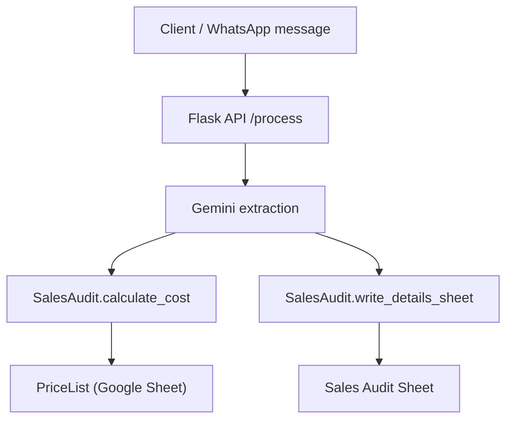
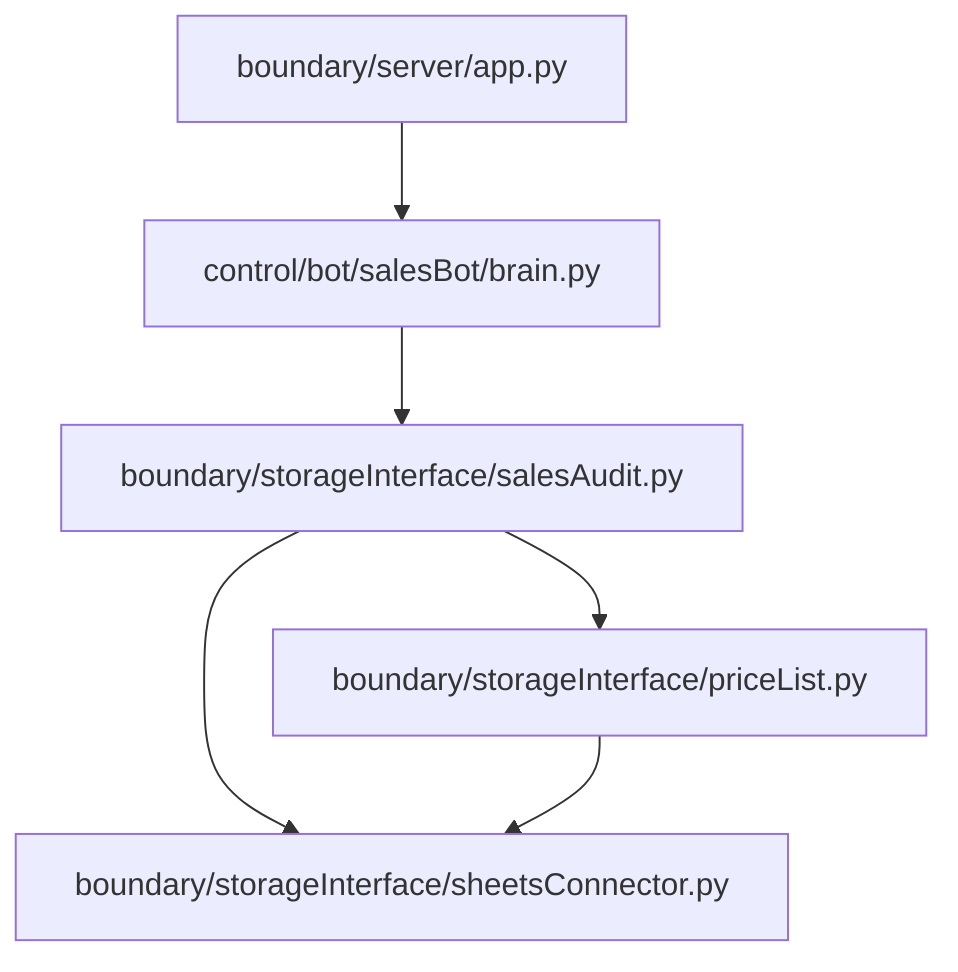

# hotelStaffManager

## Overview
This service ingests WhatsApp-style sales messages, extracts structured fields using Gemini, and logs the results into Google Sheets. Pricing is calculated from a separate pricelist sheet.

## Local Setup
### 1) Install dependencies
```bash
cd <PROJECT_ROOT>
python -m pip install -r requirements.txt -r requirements-dev.txt
```

### 2) Configure environment
Create a local `env` file (this repo ignores it):
```
GEMINI_API_KEY=...
GOOGLE_SHEETS_KEY=envConfig/sales/salesAccount.json
SALES_AUDIT_SHEET_ID=...
SALES_PRICELIST_SHEET_ID=...
```

Notes:
- `GOOGLE_SHEETS_KEY` can be relative; it resolves against the project root.
- Share both sheets with the Google service account email.

### 3) Run the server
```bash
cd <PROJECT_ROOT>/boundary/server
python app.py
```

### 4) Send a request
```bash
curl -X POST http://127.0.0.1:5000/process \
  -H "Content-Type: application/json" \
  -d '{"message":"Service: 2 Hammame\nDate: 04/03/2026\nGuest:2px\nTime:6:00pm\nRoom:The Sahara Room\nArjun Rampal"}'
```

## Local Testing
### Run all checks (recommended)
```bash
<PROJECT_ROOT>/scripts/run_checks.sh
```

Optional flags:
- `SKIP_PIP_AUDIT=1` skips `pip-audit`
- `RUN_INTEGRATION=1` runs integration tests

### Run individual tools
```bash
python -m ruff check .
python -m ruff format --check .
python -m mypy .
python -m bandit -c bandit.yaml -r .
python -m pip_audit -r requirements.txt -r requirements-dev.txt
pytest -m "not integration"
```

### Integration tests
Integration tests hit real Google Sheets and are opt-in via env:
```bash
HEALTHCHECK_WRITE=1 HEALTHCHECK_TESTPY=1 pytest -m integration
```

## CI Jobs
CI runs on pull requests only. Jobs are parallelized for faster feedback.

### `lint`
- Runs `ruff check .`
- Catches syntax errors, unused imports, style issues, and common bug patterns.

### `format`
- Runs `ruff format --check .`
- Ensures consistent formatting without mutating code in CI.

### `typecheck`
- Runs `mypy .`
- Verifies type annotations and catches type mismatches.

### `bandit`
- Runs `bandit -c bandit.yaml -r .`
- Security lint for risky patterns (e.g., shell injection, weak crypto).

### `pip-audit`
- Runs `pip_audit -r requirements.txt -r requirements-dev.txt`
- Checks dependencies for known CVEs.

### `unit-tests`
- Runs `pytest -m "not integration"`
- Fast tests that don’t hit external services.

### `integration-tests`
- Runs `pytest -m integration`
- Hits real Google Sheets.
- Only runs when required secrets are present.

### CI Secrets (repo-level)
Required for integration tests:
- `GOOGLE_SHEETS_JSON`
- `SALES_AUDIT_SHEET_ID`
- `SALES_PRICELIST_SHEET_ID`

Optional:
- `GEMINI_API_KEY`
- `ENABLE_WRITE_TESTS` (set to `1`)
- `ENABLE_TESTPY_INTEGRATION` (set to `1`)

## Code Flow


## Module Guide


- `boundary/storageInterface/sheetsConnector.py`
  - Shared connector for Google Sheets, handles auth and worksheet selection.
- `boundary/storageInterface/priceList.py`
  - Read/write wrapper around the sales pricelist sheet.
- `boundary/storageInterface/salesAudit.py`
  - Read/write wrapper around the sales audit sheet.
  - Calculates cost using the pricelist data.
- `control/bot/salesBot/brain.py`
  - Message extraction and orchestration logic.
- `boundary/server/app.py`
  - Flask API entrypoint.

## Troubleshooting
- **Service account file not found**: check `GOOGLE_SHEETS_KEY` path.
- **Permission denied on sheets**: share the sheets with the service account email.
- **Gemini errors**: confirm `GEMINI_API_KEY` is valid and has quota.

## EVB Pattern (Brief)
This project follows an **EVB (Entity–Boundary–Control)** pattern:
- **Entity**: core domain data (stored in Google Sheets).
- **Boundary**: external interfaces/adapters (Sheets connector, API server).
- **Control**: orchestration and business logic (`salesBot/brain.py`).
