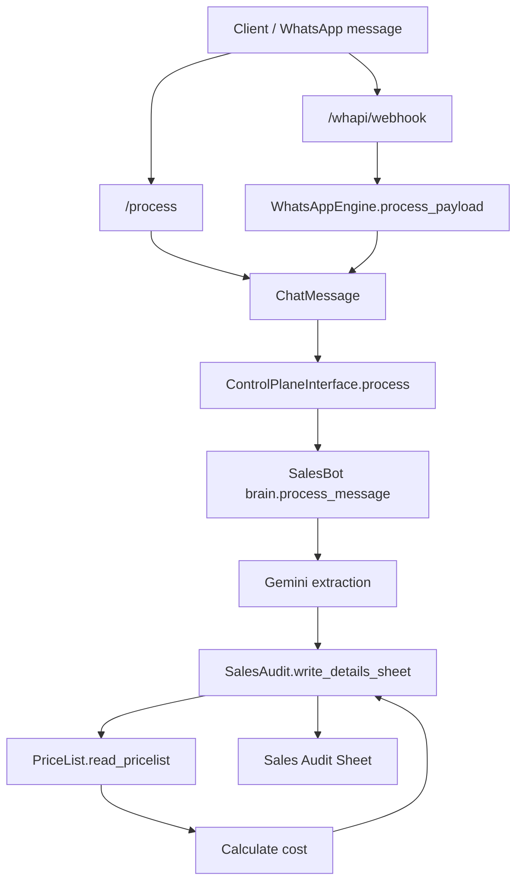
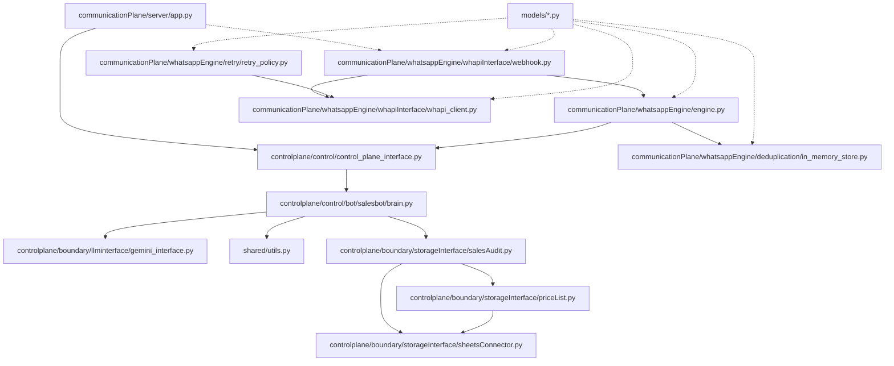

re# hotelStaffManager

## Overview 
This service ingests WhatsApp-style sales messages, extracts structured fields using Gemini, and logs the results into Google Sheets. Pricing is calculated from a separate pricelist sheet.

## Local Setup
### 1) Install dependencies
```bash
cd <PROJECT_ROOT>
python -m pip install -r requirements.txt -r requirements-dev.txt
```

### 2) Configure environment
Create a local `env` file (this repo ignores it):
```
GEMINI_API_KEY=...
GOOGLE_SHEETS_KEY=envConfig/sales/salesAccount.json
SALES_AUDIT_SHEET_ID=...
SALES_PRICELIST_SHEET_ID=...
```

Notes:
- `GOOGLE_SHEETS_KEY` can be relative; it resolves against the project root.
- Share both sheets with the Google service account email.

Optional (WHAPI):
```
WHAPI_TOKEN=...
WHAPI_BASE_URL=https://gate.whapi.cloud
WHAPI_TOKEN_IN_QUERY=0
WHAPI_TIMEOUT=20
```

### 3) Run the server
```bash
cd <PROJECT_ROOT>/communicationPlane/server
python app.py
```

### 4) Send a request
```bash
curl -X POST http://127.0.0.1:5000/process \
  -H "Content-Type: application/json" \
  -d '{"message":"Service: 2 Hammame\nDate: 04/03/2026\nGuest:2px\nTime:6:00pm\nRoom:The Sahara Room\nArjun Rampal"}'
```

## Operations
### Restart-safe stack runner
Use this wrapper to restart the tunnel/server if either crashes:
```bash
<PROJECT_ROOT>/communicationPlane/publicTrafficHandler/whatsapp_stack_runner.sh
```

Environment overrides:
- `SERVER_HOST`, `SERVER_PORT` (bind address for the Flask server)
- `RESTART_DELAY`, `MAX_RESTART_DELAY` (backoff in seconds)

### Production notes
- For production, run the Flask app with a WSGI server (e.g., `gunicorn`) via `SERVER_CMD`.
- On macOS, use `launchd` to run `whatsapp_stack_runner.sh` on startup.
- On Linux, use `systemd` with a restart policy for the runner or `cloudflared` service.

## Local Testing
### Run all checks (recommended)
```bash
<PROJECT_ROOT>/scripts/run_checks.sh
```

Optional flags:
- `SKIP_PIP_AUDIT=1` skips `pip-audit`
- `RUN_INTEGRATION=1` runs integration tests

### Run individual tools
```bash
python -m ruff check .
python -m ruff format --check .
python -m mypy .
python -m bandit -c bandit.yaml -r .
python -m pip_audit -r requirements.txt -r requirements-dev.txt
pytest tests/unit
```

### Integration tests
Integration tests hit real Google Sheets and are opt-in via env:
```bash
HEALTHCHECK_WRITE=1 HEALTHCHECK_TESTPY=1 pytest tests/integration -m integration
```

## Debugging
### DNS resolution for public tunnel
If `dig` resolves the domain but `curl` cannot, your local resolver is stale.

1. Verify public DNS:
```bash
dig +short kodesia.tech @1.1.1.1
dig +short kodesia.tech @8.8.8.8
```

2. If those return IPs but local `dig` does not, update Mac DNS:
System Settings → Wi‑Fi → Details → DNS → add:
```
1.1.1.1
8.8.8.8
```

3. Flush local caches and restart Wi‑Fi:
```bash
sudo dscacheutil -flushcache
sudo killall -HUP mDNSResponder
```

4. Confirm local DNS and test:
```bash
dig +short kodesia.tech
curl -i https://kodesia.tech/process
```

5. Bypass local DNS temporarily (replace IP with any from `dig`):
```bash
curl -i --resolve kodesia.tech:443:172.67.139.224 https://kodesia.tech/process
```

### Test layout
- `tests/unit/communicationPlane/whatsappEngine/`: WhatsApp engine unit tests (dedup, retry, engine, webhook).
- `tests/unit/controlplane/salesbot/`: SalesBot brain unit tests.
- `tests/unit/controlplane/boundary/`: Boundary unit tests (LLM interface, sheets helpers).
- `tests/unit/shared/`: Shared utility unit tests.
- `tests/integration/test_sheets_connector.py`: Integration tests hitting real Google Sheets.
- `tests/integration/communicationPlane/publicTrafficHandler/`: Integration tests for tunnel/start scripts (stubbed).
- `tests/integration/communicationPlane/whatsappEngine/`: Integration tests for webhook + engine flow (local Flask client).

### How to run specific tests
- WhatsApp engine unit tests:
  - `pytest tests/unit/communicationPlane/whatsappEngine`
- SalesBot unit tests:
  - `pytest tests/unit/controlplane/salesbot`
- Boundary unit tests:
  - `pytest tests/unit/controlplane/boundary`
- Shared unit tests:
  - `pytest tests/unit/shared`
- Integration tests:
  - `pytest tests/integration -m integration`

## CI Jobs
CI runs on pull requests only. Jobs are parallelized for faster feedback.

### `lint`
- Runs `ruff check .`
- Catches syntax errors, unused imports, style issues, and common bug patterns.

### `format`
- Runs `ruff format --check .`
- Ensures consistent formatting without mutating code in CI.

### `typecheck`
- Runs `mypy .`
- Verifies type annotations and catches type mismatches.

### `bandit`
- Runs `bandit -c bandit.yaml -r .`
- Security lint for risky patterns (e.g., shell injection, weak crypto).

### `pip-audit`
- Runs `pip_audit -r requirements.txt -r requirements-dev.txt`
- Checks dependencies for known CVEs.

### `unit-tests`
- Runs `pytest tests/unit`
- Fast tests that don’t hit external services.

### `integration-tests`
- Runs `pytest tests/integration -m integration`
- Hits real Google Sheets.
- Only runs when required secrets are present.

### CI Secrets (repo-level)
Required for integration tests:
- `GOOGLE_SHEETS_JSON`
- `SALES_AUDIT_SHEET_ID`
- `SALES_PRICELIST_SHEET_ID`

Optional:
- `GEMINI_API_KEY`
- `ENABLE_WRITE_TESTS` (set to `1`)
- `ENABLE_TESTPY_INTEGRATION` (set to `1`)

## Code Flow


## Module Guide


- `controlplane/boundary/storageInterface/sheetsConnector.py`
  - Shared connector for Google Sheets, handles auth and worksheet selection.
- `controlplane/boundary/storageInterface/priceList.py`
  - Read/write wrapper around the sales pricelist sheet.
- `controlplane/boundary/storageInterface/salesAudit.py`
  - Read/write wrapper around the sales audit sheet.
  - Calculates cost using the pricelist data.
- `controlplane/control/control_plane_interface.py`
  - Dispatches `ChatMessage` to the right bot (currently SalesBot).
- `controlplane/control/bot/salesbot/brain.py`
  - Message extraction and orchestration logic.
- `controlplane/boundary/llminterface/gemini_interface.py`
  - Gemini client wrapper with fixed model/config.
- `shared/utils.py`
  - Shared helpers (e.g., `safe_json_parse`).
- `communicationPlane/whatsappEngine/engine.py`
  - Ingests WHAPI payloads, generates dedup IDs, converts to `ChatMessage`, and calls the control plane.
- `communicationPlane/whatsappEngine/whapiInterface/whapi_client.py`
  - WHAPI client for sending WhatsApp notifications.
- `communicationPlane/whatsappEngine/whapiInterface/webhook.py`
  - Webhook parsing and Flask blueprint helpers.
- `communicationPlane/whatsappEngine/deduplication/in_memory_store.py`
  - In-memory deduplication for message IDs.
- `communicationPlane/whatsappEngine/retry/retry_policy.py`
  - Retry wrapper for WHAPI client calls.
- `models/chat_message.py`
  - Generic inbound message shape used by the control plane.
- `models/whapi.py`
  - Shared dataclasses for WHAPI config and messages.
- `models/deduplication.py`
  - Shared dataclasses for in-memory deduplication.
- `models/retry.py`
  - Shared retry dataclasses and helpers.
- `communicationPlane/server/app.py`
  - Flask API entrypoint.

### Dedup ID Strategy (WHAPI)
- Prefer the WHAPI message `id` when present.
- If it is missing, derive a stable ID from `chat_id`, `from`, `timestamp`, `type`, and `text` and hash it.

## Troubleshooting
- **Service account file not found**: check `GOOGLE_SHEETS_KEY` path.
- **Permission denied on sheets**: share the sheets with the service account email.
- **Gemini errors**: confirm `GEMINI_API_KEY` is valid and has quota.

## ECB Pattern (Brief)
This project follows an **ECB (Entity–Boundary–Control)** pattern:
- **Entity**: core domain data (stored in Google Sheets).
- **Boundary**: external interfaces/adapters (Sheets connector, API server).
- **Control**: orchestration and business logic (`controlplane/control/bot/salesbot/brain.py`).
